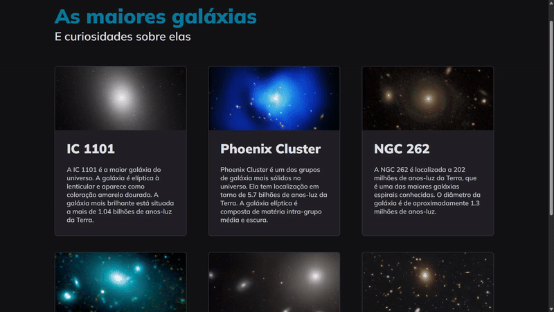

# Explorer - Galaxies

> Este é um exemplo de uma página HTML simples que lista algumas das maiores galáxias conhecidas, juntamente com algumas informações sobre cada uma delas.

## Estrutura do HTML

- `header`: Contém um título e um subtítulo para a página.
- `main`: Contém várias divs com a classe `.card`, cada uma representando uma galáxia diferente.
  - Dentro de cada `.card`, há uma imagem, um título e um parágrafo com informações sobre a galáxia.

## Estilo CSS

- Definimos um estilo de reset para remover as margens e preenchimentos padrão dos elementos HTML.
- O fundo do corpo da página é definido como `#121214`.
- Utilizamos o `display: grid` para centralizar o conteúdo horizontalmente.
- O título e o subtítulo do cabeçalho têm cores específicas e estilos de fonte.
- O conteúdo principal é exibido em um layout de grade de três colunas usando `display: grid`.
- As `.cards` que representam cada galáxia têm um fundo escuro, bordas arredondadas e um espaçamento interno.
- Os títulos e parágrafos dentro das `.cards` têm estilos de fonte e cores específicas.

## Utilização de Grid

- O layout principal da página utiliza `display: grid` para organizar o conteúdo em três colunas.
- As `.cards` dentro do `main` são colocadas automaticamente em células de grade usando o `grid-template-columns`.
- O `gap` é usado para adicionar espaçamento entre as `.cards`.

## Tecnologias Utilizadas

- **HTML e CSS:** Linguagens base para estruturação e estilização da página.
- **Grid Layout:** Utilizado para criar uma estrutura de grade para organizar o conteúdo em três colunas.

